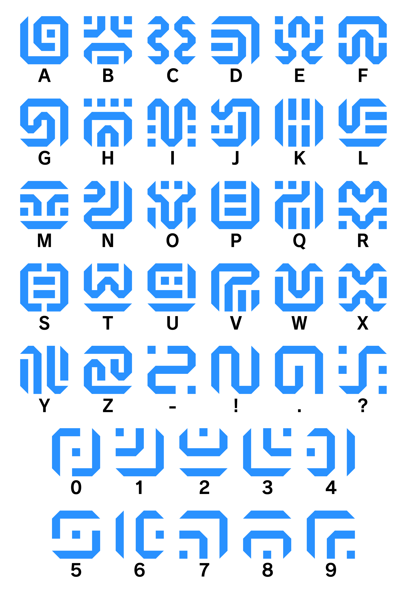

# DoodleBet

DoodleBet introduces an innovative approach to communication, intertwining letters and drawings to redefine the conventional way we interact with language. At its core lies a unique concept where each letter of the alphabet corresponds to a personalized drawing, transforming textual communication into a visually engaging experience.

In this project, I've meticulously crafted a visual mapping system where every letter finds its representation in a distinctive and whimsical drawing. By associating each letter with a unique doodle or illustration, DoodleBet revolutionizes how we perceive and engage with written language.

For instance, 'A' might be linked to a delightful apple sketch, 'B' to a vibrant butterfly, and so on. This creative mapping not only breathes life into the alphabet but also infuses it with a sense of creativity and individuality. Users can explore this personalized lexicon, deciphering messages and expressions through a charming visual language rather than traditional text.

# Inspiration

The Legend of Zelda: Breath of the Wild introduced a captivating hieroglyph system, a visual language employed within the Sheikah Slate to communicate information, instructions, and lore. This innovative system intrigued me with its fusion of ancient symbols, storytelling, and gameplay mechanics, inspiring my exploration into creating a similar system.

# Demonstration 

https://github.com/michaelwu2004/doodlebet/assets/62720843/42049b42-0c97-4254-a6c3-13ee5dc2f233

